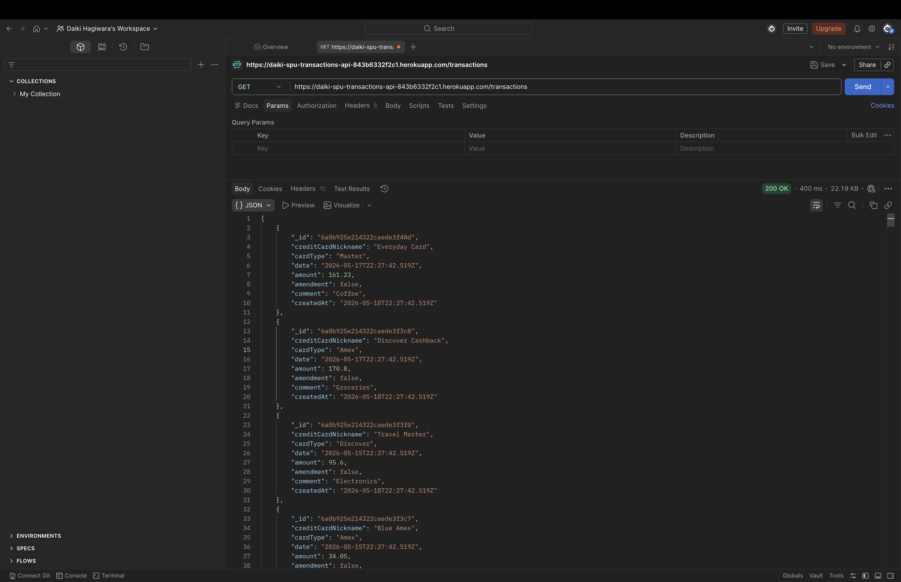
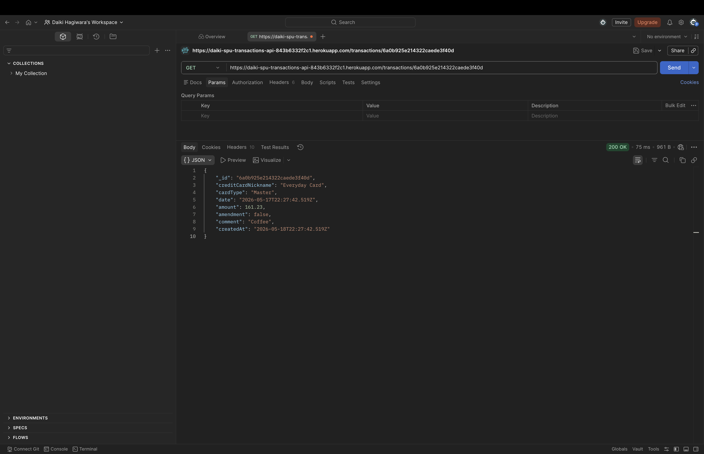
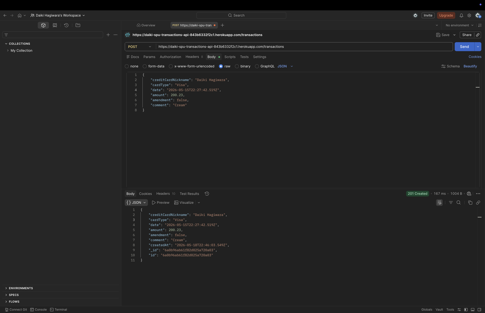
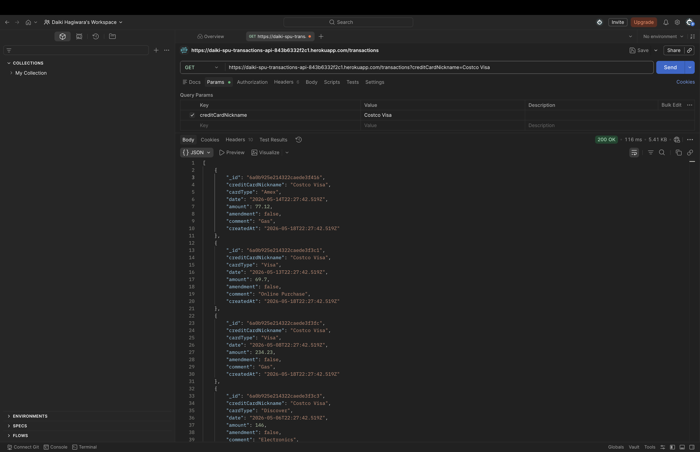
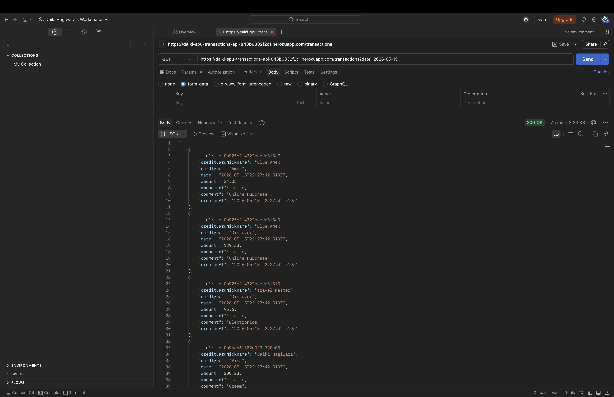
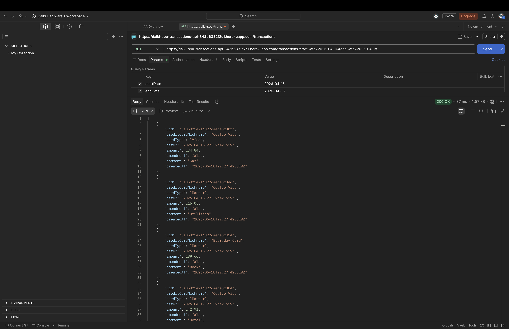

# Transactions API

This project is a REST API for credit card transactions. It uses Node.js, Express, MongoDB, and Heroku. The API allows users to create and read transaction records. It also supports filtering transactions by credit card nickname and date.

## Deployed Application

[Deployed Transactions API](https://daiki-spu-transactions-api-843b6332f2c1.herokuapp.com)

## What were the new things you learned in this activity?

In this activity, I learned how to deploy a Node.js and Express API to Heroku. I also learned how to connect a deployed application to MongoDB Atlas using environment variables.

One important thing I learned was that Heroku does not use my local `.env` file. Instead, I needed to set the `MONGODB_URI` in Heroku Config Vars. I also learned how to check Heroku logs when the application crashes or has connection problems.

I also practiced testing API routes using both the browser and Postman.

## What is the purpose of the seed.js program?

The purpose of the `seed.js` program is to insert sample transaction data into the MongoDB database.

Instead of manually creating many transactions one by one, the seed program automatically generates sample transaction records and inserts them into the `transactions` collection. This makes it easier to test the API with real data.

The seed data includes fields such as:

- credit card nickname
- card type
- date
- amount
- amendment status
- comment
- created date

This helped me test the GET routes and filtering routes more easily.

## What was the most difficult thing to do in this activity?

The most difficult thing was connecting the deployed Heroku application to MongoDB Atlas.

At first, the MongoDB connection string was not correct, so the app could not connect to the database. I also had to understand that Heroku uses Config Vars instead of my local `.env` file.

Another difficult part was reading the Heroku logs. The logs showed that the app was crashing because of the MongoDB connection issue. After checking the logs, I was able to fix the connection and get the server running.

## How would you say you were prudent in this assignment?

I was prudent in this assignment by checking my deployed application carefully before submitting it.

I tested the routes in the browser and in Postman. I also used Heroku logs to confirm when the app was crashing and when it successfully connected to MongoDB.

I was also careful with the MongoDB connection string by using environment variables instead of hardcoding the database connection directly inside the main server code.

## How would you say you need to be prudent when developing this kind of web application?

When developing this kind of web application, I need to be prudent with database credentials, user input, and error handling.

Database credentials should not be pushed to GitHub. They should be stored in environment variables, such as Heroku Config Vars.

I also need to validate user input before saving data to the database. This helps prevent invalid data from being stored. For example, the API checks that the card type, date, and amount are valid before creating a transaction.

I also need to check logs carefully when something goes wrong. Logs help find the real problem instead of guessing.

## API Routes Tested

| Method | Route | Purpose |
|---|---|---|
| GET | `/` | Check if the API is running |
| GET | `/transactions` | Get all transactions |
| GET | `/transactions/:id` | Get one transaction by ID |
| POST | `/transactions` | Create a new transaction |
| GET | `/transactions?creditCardNickname=Costco%20Visa` | Filter transactions by credit card nickname |
| GET | `/transactions?date=2026-05-18` | Filter transactions by one date |
| GET | `/transactions?startDate=2026-03-01&endDate=2026-05-18` | Filter transactions by date range |

## Screenshots

### GET /transactions

### GET /transactions/:id

### POST /transactions

### GET /transactions?creditCardNickname=Costco%20Visa

### GET /transactions?date=2026-05-15

### GET /transactions?startDate=2026-04-16&endDate=2026-04-18

